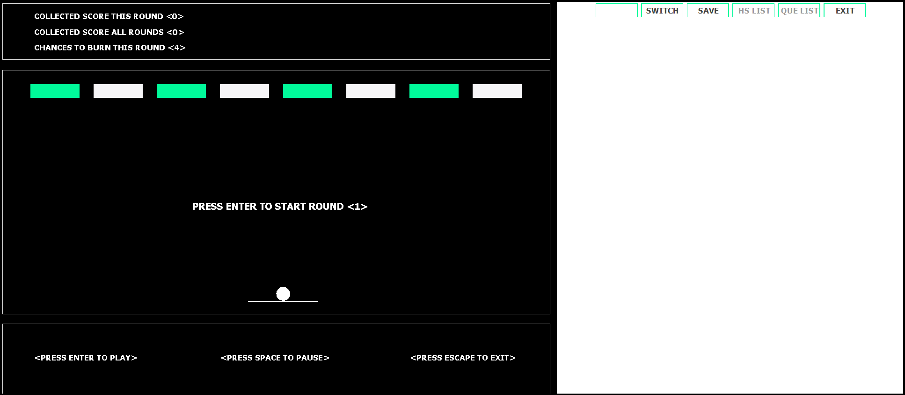

# Brickstorm
---

## Overview

A classic **Breakout** arcade game built in **Java** using a provided game engine. 
Control a paddle with arrow keys to bounce a ball and destroy cyan bricks.

### Features
- Ball bounces off walls, paddle, and bricks.
- Bricks require **2 hits** to break → **2 points each**.
- **3 rounds**: 4 lives in round 1, 2 lives in rounds 2–3.
- **Highscore**: Top 10 saved in `highscore.txt` (initials if score > 5).
- **Last 3 games**: Queue-style list in `last3.txt`.
- Buttons: `HS List`, `Que List`.

  
*Figure 1: Breakout game window*

---

## Controls

| Key       | Action               |
|-----------|----------------------|
| ← / →     | Move paddle          |
| Space     | Pause                |
| ESC       | Quit                 |
| HS List   | Show highscore       |
| Que List  | Show last 3 games    |

---

## How to Run

### Requirements
- Java JDK 8+

### Clone from GitHub
```bash
git clone https://github.com/mustafahrahimi/Brickstorm.git

cd Brickstorm
